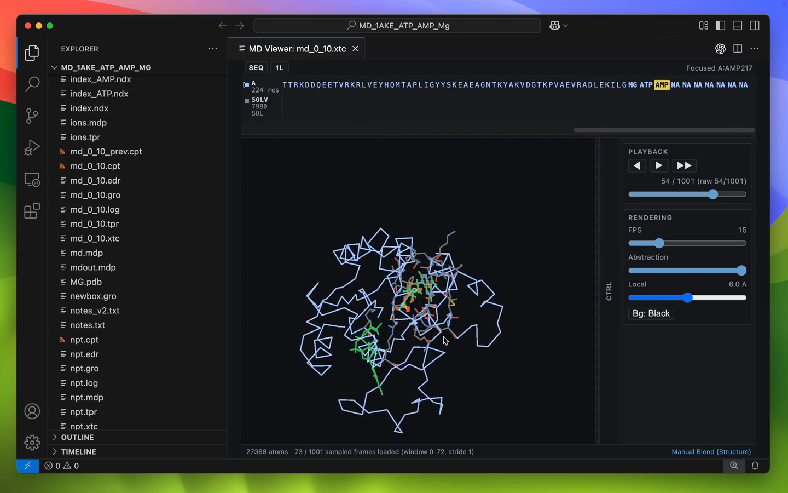
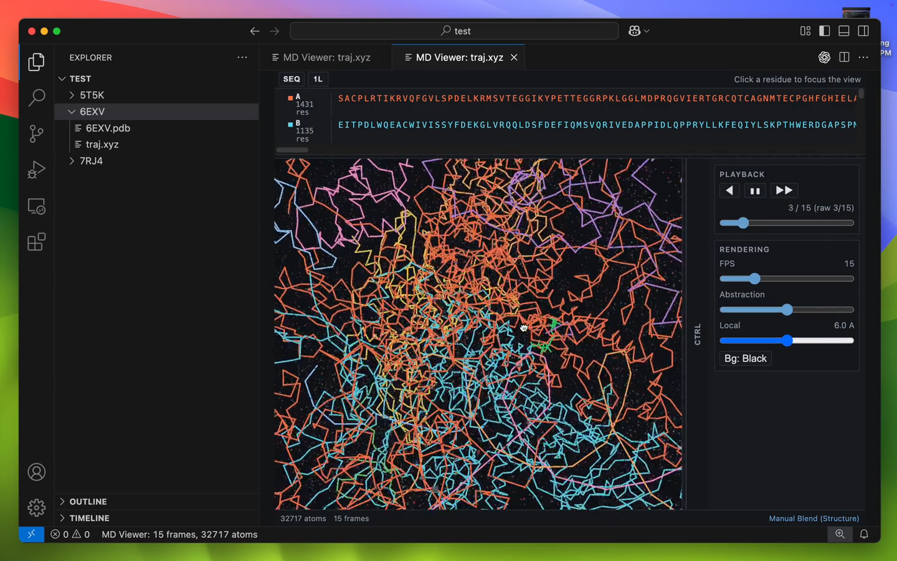

# MD Viewer — VS Code Extension

<p align="center">
  <a href="docs/assets/logo/horizontal.pdf">MD Viewer logo PDF</a>
</p>

A molecular dynamics dataset viewer for VS Code with setup-panel based loading, topology pairing, and chunked binary trajectory support.

---

## Showcase

Click either thumbnail to open GitHub-hosted video playback.

| Monomer, ligand, solvent, and ions | Complexes, nucleotides, and multiple chains |
| --- | --- |
| [](https://raw.githubusercontent.com/DomFico/md-viewer/release/v0.1.0/docs/assets/videos/monomer_ligand_solvent_demo.mp4) | [](https://raw.githubusercontent.com/DomFico/md-viewer/release/v0.1.0/docs/assets/videos/complexes_nucleotides_demo.mp4) |
| Shows a monomeric system with a bound ligand, solvent/ion point-cloud rendering, and solvent visibility controls. | Shows larger structural systems with protein complexes, nucleotide traces, multiple chains, and local-context navigation. |

---

## What it does

- Launch from Explorer on supported trajectory/topology files via **Launch MD Viewer**
- Resolve dataset pairings in a setup panel with override controls
- Render trajectories with residue-aware navigation and selection
- Show useful polymer traces for proteins and nucleic acids
- Support trajectories: `.xyz`, `.xtc`, `.dcd`, `.trr`, `.nc`, `.rst7`, `.inpcrd`, `.mdcrd`
- Support topologies: `.pdb`, `.gro`, `.parm7`, `.prmtop`
- Stream binary trajectories through metadata-first init + chunked frame requests

---

## Molecular Semantics

- Protein traces use `CA` atoms.
- DNA/RNA traces use nucleotide backbone anchors, preferring `P` with sugar-backbone fallbacks such as `C4'`, `C3'`, and `O3'`.
- Residue selection highlights selected atoms, selected bonds/sticks, and nearby/local-context bonds when topology bond data is available.
- Ligands, ions, common solvent, and custom/nonstandard residues are routed separately so bulk solvent does not dominate navigation.

Amber-family notes:
- `.parm7` and `.prmtop` are handled through the Amber topology bridge.
- `.nc`, `.rst7`, `.inpcrd`, and `.mdcrd` are handled through the Python bridge/runtime path.
- Topology and trajectory atom counts must match; the viewer rejects mismatched pairings rather than weakening topology semantics.

---

## Install from VSIX

```bash
code --install-extension md-viewer-<version>.vsix
```

Then run:
- **MD Viewer: Run Dependency Diagnostics**
- **MD Viewer: Select Python Interpreter** (if needed)
- **MD Viewer: Bootstrap Remote Python Runtime** (optional, useful on Remote SSH/HPC)

---

## Dependency notes

MD Viewer bridge/runtime dependencies:
- Python 3.10+ reachable by PATH or `mdViewer.pythonInterpreter`
- Python packages: `mdtraj`, `numpy`, `scipy` (and `netCDF4` recommended for some environments)

If you use VS Code Remote SSH, dependencies must be installed on the remote host where the extension host runs.

See deployment guide:
- [docs/INSTALLATION_LOCAL_REMOTE.md](docs/INSTALLATION_LOCAL_REMOTE.md)
- [docs/REMOTE_UI_SMOKE_CHECKLIST.md](docs/REMOTE_UI_SMOKE_CHECKLIST.md)
- [docs/HPC_COMPUTECANADA_NIBI_TROUBLESHOOTING.md](docs/HPC_COMPUTECANADA_NIBI_TROUBLESHOOTING.md)

---

## How to run the extension in VS Code

### 1. Install dependencies

```bash
cd vscode-md-viewer
npm install
```

### 2. Compile TypeScript

```bash
npm run compile
```

Or watch mode for iterative development:

```bash
npm run watch
```

### 3. Launch Extension Development Host

In VS Code:
- Open the `vscode-md-viewer` folder (or the repo root)
- Press **F5** (or go to Run → Start Debugging)
- VS Code will open a new **Extension Development Host** window

### 4. Open a trajectory

In the Extension Development Host window:
1. Open a folder that contains one of your trajectory/topology datasets.
2. In the Explorer, right-click a supported file such as `.xyz`, `.pdb`, `.gro`, `.xtc`, `.dcd`, `.trr`, `.nc`, `.rst7`, `.inpcrd`, `.mdcrd`, `.parm7`, or `.prmtop`.
3. Click **Launch MD Viewer**.

The viewer panel opens and the trajectory begins at frame 1. Hit Play ▶ or press **Space**.

---

## Controls

| Control | Action |
|---------|--------|
| ▶ / ‖ button | Play / Pause |
| ◀ button | Previous frame |
| ▶▶ button | Next frame |
| Frame slider | Scrub to any frame |
| FPS slider | Change playback speed (1–60 fps) |
| ↺ button | Reset camera & return to frame 1 |
| Left-drag | Orbit camera |
| Scroll wheel | Zoom |
| **Space** | Play / Pause |
| **← / →** | Previous / Next frame |
| **Home / End** | Jump to first / last frame |

---

## Extension file layout

```
vscode-md-viewer/
  package.json          VS Code extension manifest
  tsconfig.json         TypeScript config
  src/
    extension.ts        Activation & command registration
    commands/
      openMdViewer.ts   File read, parse, open webview
    parsing/
      xyz.ts            Multi-frame XYZ parser
    webview/
      getHtml.ts        Generates the webview HTML
  media/
    viewer.js           Three.js renderer & playback engine
    viewer.css          Dark-mode UI styles
  out/                  Compiled JS (created by tsc)
```

---

## Current limitations

- Large systems may still require careful Python/runtime dependency setup
- Remote/HPC deployments require matching Python environment on remote extension host
- Marketplace publishing metadata may still evolve as release process stabilizes

---
