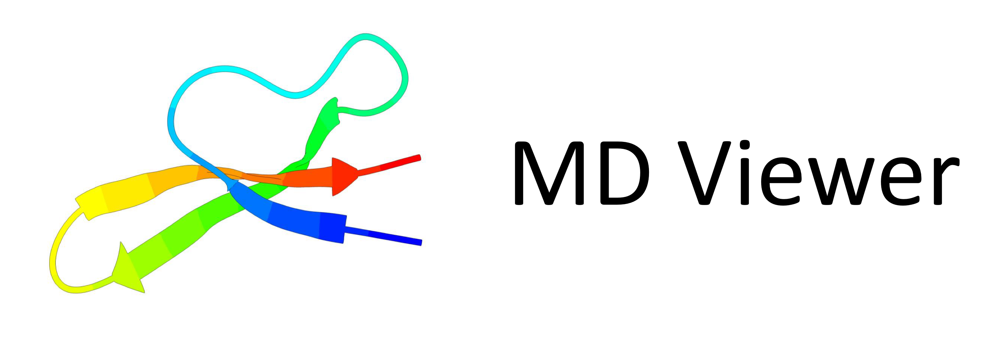
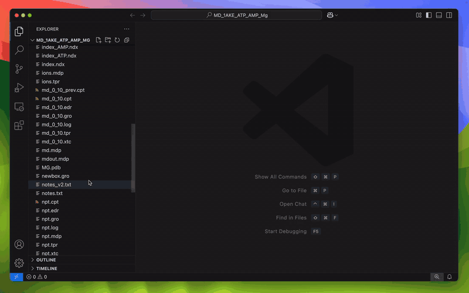
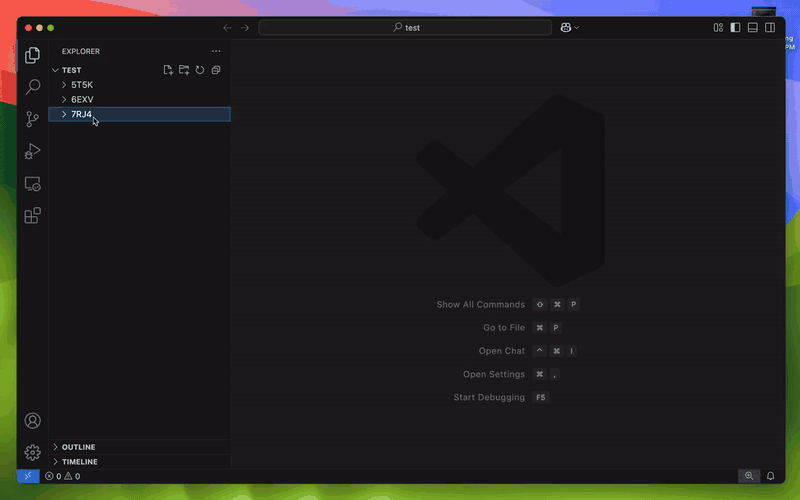

<p align="center">
  
</p>

<h1 align="center">MD Viewer — VS Code Extension</h1>

---

## Showcase

| Monomer, ligand, solvent, and ions | Complexes, nucleotides, and multiple chains |
| --- | --- |
| [](https://raw.githubusercontent.com/DomFico/md-viewer/release/v0.1.0/docs/assets/videos/monomer_ligand_solvent_demo.mp4) | [](https://raw.githubusercontent.com/DomFico/md-viewer/release/v0.1.0/docs/assets/videos/complexes_nucleotides_demo.mp4) |
| Autoplay preview: monomeric system with a bound ligand, solvent/ion point-cloud rendering, and solvent visibility controls. Click for the full MP4. | Autoplay preview: larger structural systems with protein complexes, nucleotide traces, multiple chains, and local-context navigation. Click for the full MP4. |

---

## What it does

- Launch from Explorer on supported trajectory/topology files via **Launch MD Viewer**
- Resolve dataset pairings in a setup panel with override controls
- Render trajectories with residue-aware navigation and selection
- Show useful polymer traces for proteins and nucleic acids
- Support trajectories: `.xyz`, `.xtc`, `.dcd`, `.trr`, `.nc`, `.rst7`, `.inpcrd`, `.mdcrd`
- Support topologies: `.pdb`, `.gro`, `.parm7`, `.prmtop`
- Stream binary trajectories through metadata-first init + chunked frame requests

---

## Molecular Semantics

- Protein traces use `CA` atoms.
- DNA/RNA traces use nucleotide backbone anchors, preferring `P` with sugar-backbone fallbacks such as `C4'`, `C3'`, and `O3'`.
- Residue selection highlights selected atoms, selected bonds/sticks, and nearby/local-context bonds when topology bond data is available.
- Ligands, ions, common solvent, and custom/nonstandard residues are routed separately so bulk solvent does not dominate navigation.

Amber-family notes:
- `.parm7` and `.prmtop` are handled through the Amber topology bridge.
- `.nc`, `.rst7`, `.inpcrd`, and `.mdcrd` are handled through the Python bridge/runtime path.
- Topology and trajectory atom counts must match; the viewer rejects mismatched pairings rather than weakening topology semantics.

---

## Install from VSIX

```bash
code --install-extension md-viewer-<version>.vsix
```

## Install and First Run

After installing MD Viewer, the best first step is to check the runtime it will use.

1. Open the Command Palette with `Ctrl+Shift+P`.
2. Run `MD Viewer: Run Dependency Diagnostics`.
3. Review the result.
4. If runtime is not ready, run `MD Viewer: Bootstrap Remote Python Runtime`.
5. If needed, run `MD Viewer: Select Python Interpreter`.
6. Right-click a supported file and choose **Launch MD Viewer**.

What this means:
- The extension install adds commands/UI in VS Code.
- MD Viewer also needs a Python runtime for bridge/parsing tasks.
- In local windows, dependencies must exist locally.
- In Remote SSH windows, dependencies must exist on the remote host.

Diagnostics checks:
- selected Python interpreter
- required runtime packages (`mdtraj`, `numpy`, `scipy`, with `netCDF4` recommended in some environments)
- runtime readiness in the current extension-host context

Bootstrap notes:
- `MD Viewer: Bootstrap Remote Python Runtime` prepares a dedicated Python environment (usually under `~/.venvs/mdviewer`).
- Despite the name, it is most relevant for Remote SSH/HPC setup.
- It does not run simulations or modify your scientific data.
- If you already have a good interpreter, selecting it may be enough.

Success looks like:
- diagnostics pass
- a usable interpreter is selected
- you can launch supported files such as `.pdb`, `.gro`, `.xtc`, `.dcd`, `.trr`, `.nc`, `.rst7`, `.inpcrd`, `.mdcrd`, `.parm7`, `.prmtop`

If setup fails:
- re-run diagnostics and read the failing check
- select a different interpreter if needed
- run bootstrap in the same VS Code window/context where you will use MD Viewer
- on managed HPC, bootstrap may stop intentionally instead of forcing fragile source builds

## Remote SSH / HPC Setup (Recommended)

1. Connect to your host with a **Remote SSH** VS Code window.
2. Run `MD Viewer: Run Dependency Diagnostics`.
3. If needed, run `MD Viewer: Bootstrap Remote Python Runtime`.
4. Run diagnostics again to confirm readiness.
5. If needed, run `MD Viewer: Select Python Interpreter`.
6. Launch a supported file from Explorer.

Notes:
- Prefer Python `3.10+` when available.
- Python `3.9` is legacy/best-effort on managed systems.
- Module/conda/mamba-based environments are fine; select the intended interpreter and rerun diagnostics.

See deployment guide:
- [docs/INSTALLATION_LOCAL_REMOTE.md](docs/INSTALLATION_LOCAL_REMOTE.md)
- [docs/REMOTE_UI_SMOKE_CHECKLIST.md](docs/REMOTE_UI_SMOKE_CHECKLIST.md)
- [docs/HPC_COMPUTECANADA_NIBI_TROUBLESHOOTING.md](docs/HPC_COMPUTECANADA_NIBI_TROUBLESHOOTING.md)

---

## Development Setup (Run from Source)

This section is only for developing MD Viewer from source. If you installed the extension from a VSIX or Marketplace package, use the installation and first-run steps above instead.

### 1. Install dependencies

```bash
cd vscode-md-viewer
npm install
```

### 2. Compile TypeScript

```bash
npm run compile
```

Or watch mode for iterative development:

```bash
npm run watch
```

### 3. Launch Extension Development Host

In VS Code:
- Open the `vscode-md-viewer` folder (or the repo root)
- Press **F5** (or go to Run → Start Debugging)
- VS Code will open a new **Extension Development Host** window

### 4. Open a trajectory

In the Extension Development Host window:
1. Open a folder that contains one of your trajectory/topology datasets.
2. In the Explorer, right-click a supported file such as `.xyz`, `.pdb`, `.gro`, `.xtc`, `.dcd`, `.trr`, `.nc`, `.rst7`, `.inpcrd`, `.mdcrd`, `.parm7`, or `.prmtop`.
3. Click **Launch MD Viewer**.

The viewer panel opens and the trajectory begins at frame 1. Hit Play ▶ or press **Space**.

---

## Controls

| Control | Action |
|---------|--------|
| ▶ / ‖ button | Play / Pause |
| ◀ button | Previous frame |
| ▶▶ button | Next frame |
| Frame slider | Scrub to any frame |
| FPS slider | Change playback speed (1–60 fps) |
| ↺ button | Reset camera & return to frame 1 |
| Left-drag | Orbit camera |
| Scroll wheel | Zoom |
| **Space** | Play / Pause |
| **← / →** | Previous / Next frame |
| **Home / End** | Jump to first / last frame |

---

## Extension file layout

```
vscode-md-viewer/
  package.json          VS Code extension manifest
  tsconfig.json         TypeScript config
  src/
    extension.ts        Activation & command registration
    commands/
      openMdViewer.ts   File read, parse, open webview
    parsing/
      xyz.ts            Multi-frame XYZ parser
    webview/
      getHtml.ts        Generates the webview HTML
  media/
    viewer.js           Three.js renderer & playback engine
    viewer.css          Dark-mode UI styles
  out/                  Compiled JS (created by tsc)
```

---

## Current limitations

- Large systems may still require careful Python/runtime dependency setup
- Remote/HPC deployments require matching Python environment on remote extension host
- Marketplace publishing metadata may still evolve as release process stabilizes

---
